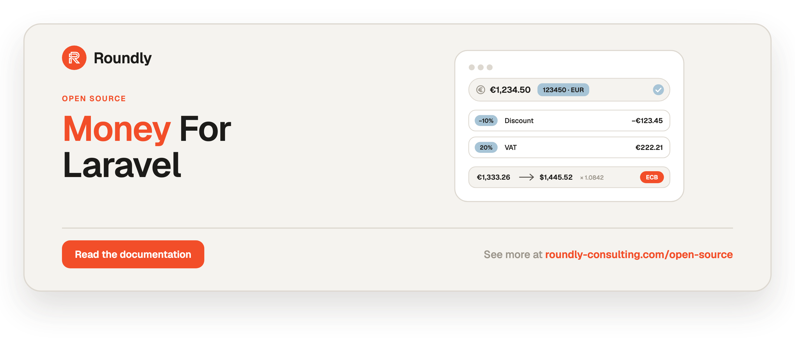

<!-- roundly-hero:start -->
<p align="center">
  <a href="https://roundly-consulting.com/open-source/docs/money-for-laravel?utm_source=github&utm_medium=readme&utm_campaign=open-source&utm_content=money-for-laravel">
    
  </a>
</p>
<!-- roundly-hero:end -->

<!-- roundly-badges:start -->
<p align="center">
  <a href="https://packagist.org/packages/roundly-consulting/money-for-laravel"></a>
  <a href="https://github.com/roundly-consulting/money-for-laravel/actions/workflows/run-tests.yml"></a>
  <a href="https://github.com/roundly-consulting/money-for-laravel/actions/workflows/fix-php-code-style-issues.yml"></a>
  <a href="https://donate.stripe.com/dRmeVe8FX5PF1Qd9pXcEw00"></a>
  <a href="https://www.patreon.com/cw/roundly"></a>
  <a href="https://roundly-consulting.com/support-us?utm_source=github&utm_medium=readme&utm_campaign=open-source&utm_content=money-for-laravel#crypto"></a>
</p>
<!-- roundly-badges:end -->

# Money for Laravel

Immutable, arbitrary-precision `Money` and `Currency` value objects for Laravel: ISO 4217 and
custom currencies, exact decimal parsing, rounding-safe arithmetic and allocation, locale
formatting, Eloquent casts and schema macros, validation, discounts, tax, and pluggable exchange
rates (config, database, ECB).

- Amounts are **minor units held as canonical integer strings** (`"1050"` = 10.50 €) with bcmath
  arithmetic — no float anywhere, no int64 ceiling (wei-precision crypto fits).
- Arithmetic and comparisons work **within one currency**; a mismatch throws. Conversion is always
  explicit.
- Every lossy operation rounds **exactly once**, with PHP 8.4's native `\RoundingMode`.

## Requirements

- PHP ^8.4 with **`ext-bcmath`**
- Laravel 12.x or 13.x
- Optional: `ext-intl` (locale-aware formatting and parsing; a deterministic formatter is used
  without it) and `ext-simplexml` (the ECB exchange-rate driver; present in standard PHP builds)

## Installation

```bash
composer require roundly-consulting/money-for-laravel
```

The service provider is auto-discovered. If your app disables package discovery, register
`RoundlyConsulting\Money\MoneyServiceProvider` yourself — other packages' migrations call the
`$table->money()` macro and fail without it.

Optionally publish the config file:

```bash
php artisan vendor:publish --tag="money-config"
```

Publish and run the migration **only if you use the `database` (or `chain`) exchange driver** — it
creates the `money_exchange_rates` table:

```bash
php artisan vendor:publish --tag="money-migrations"
php artisan migrate
```

Optionally publish the validation messages (`en`, `sk`):

```bash
php artisan vendor:publish --tag="money-translations"
```

## Configuration

`config/money.php`:

| Key | Default | Env | Meaning |
|---|---|---|---|
| `default_currency` | `'EUR'` | `MONEY_DEFAULT_CURRENCY` | Currency for `Request::money()` without one, the parser without a currency token, `money_amount` without a parameter. |
| `currencies.iso` | `true` | `MONEY_ISO_CURRENCIES` | Seed the registry with the bundled ISO 4217 list (165 currencies). `false` = custom only. |
| `currencies.custom` | `[]` | — | Extra currencies: `'PTS' => ['exponent' => 0, 'name' => 'Points', 'symbol' => 'pts']`. Exponent 0..18. |
| `currencies.allowed` | `null` | — | Allow-list for currencies chosen by input: the `CurrencyCode` / `currency_code` rule and `MoneyAmount::inCurrencyFrom()` (`null` = the whole registry). Never restricts stored data. |
| `schema.currency_length` | `3` | `MONEY_CURRENCY_LENGTH` | varchar length of currency columns (3..10) and the longest custom code the registry accepts. Fixed once migrated. |
| `schema.precision` | `38` | `MONEY_PRECISION` | `P` of the `decimal(P, 0)` amount columns `$table->money()` creates (19..65). The cast and the `MoneyAmount` rule enforce the same limit. Fixed once migrated. |
| `rounding` | `'half_away_from_zero'` | `MONEY_ROUNDING` | Service-level default rounding (formatter digit reduction, `avgMoney`). Value objects never read config. |
| `formatting.driver` | `'auto'` | `MONEY_FORMATTER` | `auto` (intl when loaded, else decimal), `intl` (fails loud without the extension), `decimal`. |
| `formatting.locale` | `null` | `MONEY_LOCALE` | `null` follows `app()->getLocale()`. |
| `formatting.display` | `'symbol'` | — | Default currency display: `symbol`, `code`, `none`. |
| `formatting.fallback.pattern` | `'{sign}{amount} {code}'` | — | Deterministic formatter pattern; placeholders `{sign}` `{amount}` `{code}` `{symbol}`. |
| `formatting.fallback.decimal_separator` | `'.'` | — | Also the parser's separator without intl. |
| `formatting.fallback.thousands_separator` | `','` | — | |
| `macros.collection` | `true` | — | Register `sumMoney` / `minMoney` / `maxMoney` / `avgMoney`. |
| `macros.request` | `true` | — | Register `Request::money()`. |
| `macros.blade` | `true` | — | Register `@money`. |
| `macros.validation` | `true` | — | Register the `currency_code` and `money_amount` string rules. |
| `exchange.default` | `'ecb'` | `MONEY_EXCHANGE_DRIVER` | Default exchange driver: `config`, `database`, `ecb`, `chain` or your own. |
| `exchange.chain` | `['database', 'ecb']` | — | Drivers the `chain` driver tries in order. |
| `exchange.pivot` | `'EUR'` | — | Triangulation currency for `config` and `database`. |
| `exchange.rounding` | `'half_even'` | `MONEY_EXCHANGE_ROUNDING` | Default rounding of conversions. |
| `exchange.timezone` | `'Europe/Berlin'` | `MONEY_EXCHANGE_TIMEZONE` | Timezone in which a conversion instant becomes a rate date. |
| `exchange.max_age_days` | `7` | `MONEY_EXCHANGE_MAX_AGE_DAYS` | A newest rate older than this is stale (refused). |
| `exchange.cache.enabled` | `true` | `MONEY_EXCHANGE_CACHE` | Cache `database`/`ecb`/custom driver lookups. |
| `exchange.cache.store` | `null` | `MONEY_EXCHANGE_CACHE_STORE` | Cache store (`null` = default). |
| `exchange.cache.ttl` | `3600` | `MONEY_EXCHANGE_CACHE_TTL` | Seconds. |
| `exchange.cache.prefix` | `'money:exchange'` | — | Cache key prefix. |
| `exchange.providers.config.rates` | `[]` | — | Static rates: `['EUR' => ['USD' => '1.0854']]` (decimal strings). |
| `exchange.providers.database.table` | `'money_exchange_rates'` | `MONEY_EXCHANGE_TABLE` | Rates table. |
| `exchange.providers.database.model` | `CurrencyRate::class` | `MONEY_EXCHANGE_MODEL` | Swappable rate model (extend `CurrencyRate`). |
| `exchange.providers.ecb.daily_url` / `recent_url` / `history_url` | ECB feed URLs | — | Daily, 90-day and full-history feeds. |
| `exchange.providers.ecb.timeout` | `10` | `MONEY_ECB_TIMEOUT` | Seconds. |
| `exchange.providers.ecb.retries` | `2` | — | Retries after the first attempt. |
| `exchange.providers.ecb.max_bytes` | `33554432` | — | Response size cap. |
| `exchange.providers.ecb.cache_ttl` | `3600` | — | Parsed-feed cache seconds. |
| `exchange.refresh.schedule` | `false` | `MONEY_EXCHANGE_SCHEDULE` | Register the refresh schedule. |
| `exchange.refresh.cron` / `timezone` / `source` | `'30 16 * * 1-5'` / `'Europe/Berlin'` / `'ecb'` | — | When and from where the schedule refreshes. |

## Usage

### Money

```php
use RoundlyConsulting\Money\Money;

$price = Money::ofMajor('19.99', 'EUR');             // minor "1999" — never a float
$fee   = Money::ofMinor(250, 'EUR');                 // 2.50 €
$total = $price->add($fee)->multiply(3);             // 67.47 €, exact
$vat   = $total->percentage('20');                   // one rounding, HalfAwayFromZero
[$a, $b, $c] = $total->allocate(1, 1, 1);            // parts always sum back to $total
$total->isGreaterThan(Money::ofMajor('50', 'EUR'));  // true
$total->add(Money::ofMajor('1', 'USD'));             // throws CurrencyMismatch

$total->minor();          // "6747"   — a string
$total->minorInt();       // 6747     — throws AmountOverflow beyond int64
$total->toDecimal();      // "67.47"  — locale-free
$total->format('sk');     // "67,47 €" (intl) / "67.47 EUR" (fallback)
(string) $total;          // "67.47 EUR"
json_encode($total);      // {"minor":"6747","decimal":"67.47","currency":"EUR"}

Money::ofMajor('10.005', 'EUR');                          // throws RoundingNecessary
Money::ofMajor('10.005', 'EUR', RoundingMode::HalfEven);   // 10.00 €
Money::ofScaled(9990, 3, 'EUR');                           // Apple milli-units → 9.99 €
```

Other operations: `subtract()`, `divide()`, `roundTo(5)` (cash rounding), `negate()`, `abs()`,
`split(3)`, `ratioTo()`, `toScaled()`, `compareTo()`, `equals()` (never throws), `isZero()`,
`isPositive()`, `isNegative()`, `Money::sum()`, `Money::min()`, `Money::max()`,
`Money::average()`, `Money::fromArray()`, `Money::parse()`, `$money->convertTo('USD')`.

### Amount precision

- `minor()` always returns the canonical integer grammar `0 | -?[1-9][0-9]{0,64}` — at most 65
  significant digits in memory (`Money::MAX_DIGITS`).
- **Never `(int)`-cast or PHP-compare raw minors** — PHP compares numeric strings through floats
  above int64. Use the `Money` comparison methods, or `minorInt()` where an `int` is really needed.
- `$table->money()` creates `decimal(38, 0)` columns (`money.schema.precision`). pgsql and MySQL
  store every digit; **SQLite is exact only within int64**, so the cast refuses wider amounts there
  instead of silently storing a float.
- JSON carries `minor` as a string: a JSON number above 2⁵³ is corrupted by JavaScript.

### Currencies

```php
use RoundlyConsulting\Money\Currency;
use RoundlyConsulting\Money\Facades\Currencies;

Currencies::get('EUR')->exponent;                                // 2
Currency::of('bhd')->numericCodeString();                        // "048"
Currencies::register(Currency::custom('ETH', 18, 'Ether', 'Ξ')); // in a provider's boot()
Money::ofMajor('1.5', 'ETH')->minor();                           // "1500000000000000000"
```

The bundled list is SIX ISO 4217 List One (published 2026-09-17) with CLDR 47 `en` symbols.
ISO currencies can never be redefined. Custom codes are 2–10 characters, exponent 0..18, and must
fit `schema.currency_length` (raise it before migrating for codes such as `USDT`).
`php artisan money:currencies {--iso} {--custom} {--code=*}` lists the registry.

### Formatting and parsing

```php
use RoundlyConsulting\Money\Formatting\FormatOptions;

$money->format();                                     // app locale
$money->format('de_CH', FormatOptions::code());       // "EUR 1’234.50"
$money->format('en', FormatOptions::whole());         // "€10" for whole amounts
$money->format('en', new FormatOptions(fractionDigits: 0, rounding: RoundingMode::HalfEven));

Money::parse('1 234,50 €', locale: 'sk');             // 1234.50 EUR
Money::parse('(1,234.50)', 'USD', 'en');              // -1234.50 USD
```

Amounts beyond 15 significant digits are formatted digit-exact (ICU only formats doubles).
The parser reads **ASCII digits only** (`0-9`): input in a native numbering system (Arabic-Indic,
Devanagari, …) is refused, even though `format()` renders those digits for such locales.
Blade: `@money($price)` or `@money($price, 'sk')`; `null` renders an empty string.

### Eloquent

```php
use RoundlyConsulting\Money\Casts\{AsCurrency, AsMoney, AsMoneyJson};

protected function casts(): array
{
    return [
        'price'            => AsMoney::class,                          // price + price_currency
        'compare_at_price' => AsMoney::currencyColumn('currency'),     // shared currency column
        'budget'           => AsMoney::fixedCurrency('EUR'),           // amount column only
        'store_credit'     => AsMoney::configCurrency('shop.currency'),
        'total'            => AsMoney::attributeCurrency('shop_currency'),
        'snapshot'         => AsMoneyJson::class,                      // {"minor":"1050","currency":"EUR"}
        'currency'         => AsCurrency::class,
    ];
}
```

```php
Schema::create('products', function (Blueprint $table) {
    $table->money('price');                                         // decimal(38,0) + price_currency
    $table->money('compare_at_price', currency: 'currency', nullable: true);
    $table->money('budget', currency: false);
    $table->moneyJson('snapshot', nullable: true);
    $table->currencyCode('shop_currency');
});
```

The casts are strict: only `Money|null` can be assigned, only in a registered currency, and a
shared currency column is never silently re-denominated — set the currency column first to
change it on purpose. `orderBy('price')`, `where('price', '>', $money->minor())` and
`sum('price')` are numerically correct (group sums by currency).

### HTTP, validation, collections

```php
use RoundlyConsulting\Money\Rules\{CurrencyCode, MoneyAmount};

$request->validate([
    'price'    => ['required', MoneyAmount::in('EUR')->positive()->max('99999.99')],
    'fee'      => [MoneyAmount::inCurrencyFrom('currency')->allowNegative()],
    'currency' => ['required', (new CurrencyCode)->isoOnly()],
    'deposit'  => 'money_amount:EUR',
]);

$price = $request->money('price', 'EUR');   // JSON 1.1 → 1.10 €, not 1.11 €

$order->items->sumMoney(fn ($item) => $item->price->multiply($item->quantity), currencyIfEmpty: 'EUR');
$prices->minMoney(); $prices->maxMoney('price'); $prices->avgMoney('price');

return ['price' => MoneyResource::from($product->price)];
// {"minor":"1050","decimal":"10.50","currency":"EUR","exponent":2,"formatted":"10,50 €"}
```

### Multi-currency totals

```php
use RoundlyConsulting\Money\MoneyBag;

$bag = MoneyBag::of($eurPrice, $usdFee)->add($czkTax);
$bag->get('USD');       // amount held in USD
$bag->total('EUR');     // converted and summed exactly, rounded once
```

### Discounts

```php
use RoundlyConsulting\Money\Discounts\{Discount, DiscountAllocator, DiscountStack};
use RoundlyConsulting\Money\Enums\StackingStrategy;

Discount::percentage('12.5')->cappedAt(Money::ofMajor('20', 'EUR'))->applyTo($subtotal);

$breakdown = DiscountStack::of(
    Discount::percentage(10)->labelled('WELCOME10'),
    Discount::fixed(Money::ofMajor('5', 'EUR'))->withPriority(10),
    Discount::freeShipping(),
    Discount::percentage(25)->exclusive(),
)->using(StackingStrategy::Sequential)->capTotalAt(Money::ofMajor('30', 'EUR'))
 ->apply($subtotal, $shipping);

$breakdown->total(); $breakdown->applied;   // list<AppliedDiscount>

app(DiscountAllocator::class)->allocate($orderDiscount, ...$lineTotals); // Σ exact, share ≤ line
```

### Tax

```php
use RoundlyConsulting\Money\Tax\{TaxRate, TaxSummary};

$vat = TaxRate::fromBasisPoints(2000, 'VAT');
$vat->taxOnNet($net); $vat->grossFromNet($net); $vat->netFromGross($gross); $vat->taxInGross($gross);
$line = $vat->breakdownFromGross($gross);   // net + tax === gross, always
TaxSummary::of(...$lines)->perRate();
```

### Exchange rates

```php
use RoundlyConsulting\Money\Facades\Exchange;

$money->convertTo('USD');                        // default driver (ecb)
$money->convertTo('USD', now()->subDay());       // historical
Exchange::convertWithRate($money, 'CZK');        // Conversion: original, converted, rate
Exchange::driver('database')->rate(Currency::of('EUR'), Currency::of('USD'));
Exchange::extend('fixer', fn ($app) => new FixerProvider(/* ... */));
```

Drivers: `config` (static rates, triangulated through the pivot), `database` (newest row on or
before the date), `ecb` (daily and 90-day feeds, cached, zero setup), `chain` (first success wins;
only "no rate" / "fetch failed" fall through). Rates are exact ratios; weekend dates use the last
published day, future dates are refused, and rates older than `max_age_days` are stale.

**Production recipe:** publish `money-migrations`, set `MONEY_EXCHANGE_SCHEDULE=true` (refreshes
from the ECB at 16:30 Berlin time on weekdays) and `MONEY_EXCHANGE_DRIVER=chain`.

Manual rates go through the one write path; a `manual` row is never overwritten by a refresh:

```php
app(StoreExchangeRatesAction::class)->execute([
    ExchangeRate::fromDecimal('EUR', 'CZK', '25.10', now(), source: 'manual'),
]);
```

### Commands and events

| Command | Purpose |
|---|---|
| `money:currencies {--iso} {--custom} {--code=*}` | List the registry. |
| `money:rates:refresh {source=ecb} {--feed=daily\|recent\|history} {--from=} {--to=} {--queue}` | Fetch rates into the table (isolatable; `--queue` dispatches a unique job). |
| `money:rates:prune {--before=} {--keep-days=} {--include-manual} {--pretend}` | Delete old rates; manual rows are kept by default. |
| `money:convert {amount} {from} {to} {--date=} {--driver=}` | Convert and show the rate used. |

Events: `ExchangeRatesRefreshed` (`RefreshResult $result`) and `ExchangeRatesRefreshFailed`
(`string $source`, `string $message`, fired before the exception is rethrown).

### Testing your app

```php
$fake = Exchange::fake(['EUR/USD' => '1.0854']);

// ... code that converts ...

$fake->assertRateRequested('EUR', 'USD');
```

### Migrating from a private Money class

| Your call | money-for-laravel |
|---|---|
| `Money::of($minor, 'EUR')`, `Money::EUR($minor)` | `Money::ofMinor($minor, 'EUR')` |
| `getMinorAmount()` / `getAmount()` / `->amount` (`int`) | `minor()` (a **string**) — or `minorInt()` where an `int` is genuinely required |
| `getAmount()` returning a string of minor units | `minor()` — **not** `toDecimal()` |
| `(int) $row->price`, `$a->getAmount() > $b->getAmount()` | `Money::ofMinor($row->price, …)`, `$a->isGreaterThan($b)` |
| `getCurrency()->getCode()` / `getCurrency()` / `->currency` | `currency()->code` |
| `plus` / `minus` / `times` | `add` / `subtract` / `multiply` |
| a `subtract()` that clamps at 0 | `Discount::applyTo()` or `Money::max([$x->subtract($y), Money::zero($c)])` |
| `multiply(float)` / `divide(float)` | `multiply('1.19')` / `divide(Ratio)` / `percentage('20')` |
| `fromMajor(float)` | `Money::ofMajor('10.50', …)` |
| `format($locale)` (÷ 100) | `format($locale)` (exponent-aware) |
| `allocate(list<int>)` | `allocate(...$ratios)` |
| a `DiscountType::apply` / `discount` helper | `Discount::fixed/percentage/freeShipping()->cappedAt()->applyTo/amountFor` |
| a float `grossDivisor()` on a tax-rate value | `TaxRate::fromBasisPoints()->netFromGross()` |
| a hand-written minor-unit rescale | `MinorUnits::rescale()` / `MinorUnits::toDecimal()` |
| config `PHP_ROUND_HALF_UP` ints | `RoundingModes::fromValue(config('pkg.rounding'), 'pkg.rounding')` |

## Testing

```bash
composer test
```

## Changelog

See [CHANGELOG.md](CHANGELOG.md).

## Contributing

Pull requests are welcome; run `composer format`, `composer analyse` and `composer test` first.

<!-- roundly-support:start -->
## Support our work

This package is free and open source, built and maintained by
[Roundly Consulting](https://roundly-consulting.com/open-source?utm_source=github&utm_medium=readme&utm_campaign=open-source&utm_content=money-for-laravel).
If it saves you time, please consider supporting our open-source work — a one-time donation, a
monthly pledge on Patreon or a crypto donation helps fund maintenance, new features and new
packages.

<a href="https://donate.stripe.com/dRmeVe8FX5PF1Qd9pXcEw00"></a>
<a href="https://www.patreon.com/cw/roundly"></a>
<a href="https://roundly-consulting.com/support-us?utm_source=github&utm_medium=readme&utm_campaign=open-source&utm_content=money-for-laravel#crypto"></a>
<!-- roundly-support:end -->

## License

The MIT License (MIT). See [LICENSE.md](LICENSE.md).
